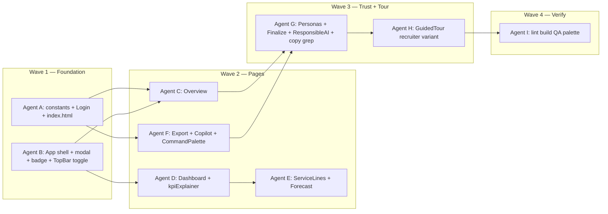

# TA / Recruiter Handoff — Implementation Plan

**Status:** Awaiting user confirmation before implementation  
**Audience:** Erin L. Rife (TA – TX), role recruiter, TA teammates reviewing work sample  
**Role:** [Sr Financial Analyst — supply chain finance, Houston](https://www.commonspirit.careers/job/houston/sr-financial-analyst/35300/94568552224)  
**Req ID:** `2026-469831`  
**Live URL:** https://hsd-audit.vercel.app

---

## Problem frame

The app is strong technically but reads like an **internal CommonSpirit workspace** (fake SSO, `@commonspirit.org` login, Cardiology-first checklist, production-sounding sign-off copy). TA reviewers need a **labeled applicant work sample** with a **5-minute Houston supply-chain path** and **job-posting traceability**.

## Scope

### In scope (all quoted requirements)

- Login & first impression (banner, demo entry, persona labels, hero, 5-min path)
- Post-login global (first-visit modal, badge, default filters, optional Houston-only toggle)
- Overview (job map card, supply-first checklist, reviewer CTA, ROI labels, Excel button)
- Dashboard (supply KPI strip, supply-first sort, KPI copy, Strata/Epic footnote)
- Service Lines (sort, callout, GPO/initiative drawer copy)
- Forecast & Walk (budget cycle line, illustrative waterfall label)
- Export Suite (recruiter copy, CSV naming, Excel helper line)
- Copilot & ⌘K (chips, header, pinned palette actions)
- Sign-off / personas (demo applicant labels, illustrative certification)
- Responsible AI (healthcare-first bio, recruiter line)
- Guided tour (recruiter 5-min variant, synthetic step 1)
- Global copy / trust (title, de-productionize strings)
- De-prioritize Simulator in recruiter flows (not remove page)

### Out of scope (unless you ask later)

- Print/PDF one-pager (nice-to-have)
- CHI Immanuel callout for Dilasha
- Real Strata/Epic integration
- Hiding Simulator from nav entirely (only skip in recruiter tour / path)

---

## Shared constants (single source of truth)

**New file:** `src/constants/recruiterHandoff.ts`

| Constant | Value |
|----------|--------|
| `JOB_REQ_ID` | `2026-469831` |
| `JOB_REQ_LABEL` | `Applicant work sample · Req 2026-469831` |
| `DISCLAIMER_SHORT` | Synthetic data · Not a CommonSpirit system or endorsement |
| `DEFAULT_REVIEW_REGION` | `Houston Market` (from `demoOrg.ts`) |
| `SUPPLY_CHAIN_LINES` | Surgical Supplies, Pharmacy Distribution, Medical Devices |
| `RECRUITER_CLICK_PATH` | 4 steps for UI copy |

Used by Login, modal, badge, Overview, Export, tour.

---

## Parallel execution model (after you confirm)

Six implementer streams + one verification stream. **No two agents edit the same file.**

| Agent | Owns | Key files |
|-------|------|-----------|
| **A** | Constants, login UX | `src/constants/recruiterHandoff.ts`, `src/pages/Login.tsx`, `index.html` |
| **B** | App shell, filters, modal, badge, header toggle | `src/components/RecruiterWelcomeModal.tsx` (new), `src/App.tsx`, `src/components/SyntheticDataBadge.tsx`, `src/components/AppTopBar.tsx` |
| **C** | Overview / job map | `src/pages/Overview.tsx` |
| **D** | Dashboard supply focus | `src/pages/Dashboard.tsx`, `src/lib/kpiExplainer.ts` |
| **E** | Service lines + forecast | `src/pages/ServiceLines.tsx`, `src/pages/Forecast.tsx`, `src/components/ServiceLineDrawer.tsx` |
| **F** | Export + AI surfaces | `src/components/ExportDataModal.tsx`, `src/pages/Copilot.tsx`, `src/components/CommandPalette.tsx`, `src/lib/paletteAiInsights.ts` (chip labels only) |
| **G** | Trust copy + personas | `src/components/FinalizeReviewModal.tsx`, `src/pages/ResponsibleAI.tsx`, `src/config/demoOrg.ts` (persona subtitles), `src/App.tsx` (footer strings only if not owned by B) |
| **H** | Recruiter tour | `src/components/GuidedTour.tsx`, `src/App.tsx` (tour mode prop only — coordinate with B) |
| **I** | Verify | `npm run lint`, `npm run build`, `npm run handoff:verify`, spot-check live path |

**Merge rule:** Parent integrates Agent B + H `App.tsx` changes in one pass if both touch `App.tsx`; otherwise sequential handoff B → H.

---

## Implementation units (traceability to your quotes)

### Unit 1 — Login & first impression (Agent A)

| # | Requirement | Approach |
|---|-------------|----------|
| 1 | Top banner with req + disclaimer | Full-width bar above header in `Login.tsx` |
| 2 | "Enter demo" not fake SSO | Replace heading/copy; shorten or remove 1200ms "AD" delay; button text **View work sample** |
| 3 | Demo email label | Label + placeholder `demo.analyst@example.com`; helper text under field |
| 4 | Persona tile disclaimer | Subtitle under analyst preset from `demoOrg` or handoff constants |
| 5 | Hero supply-chain lead | Rewrite left column paragraph (month-end variance, supply chain finance) |
| 6 | 5-minute path on login | Numbered list component under hero (Analyst → Houston → supply line → Export) |

### Unit 2 — Post-login global (Agent B)

| # | Requirement | Approach |
|---|-------------|----------|
| 7 | First-visit modal | `RecruiterWelcomeModal.tsx`; `localStorage` key `recruiter_welcome_seen`; disclaimer + path + Excel link |
| 8 | SyntheticDataBadge | Append "Applicant prototype" + req ID |
| 9 | Default filters analyst | On login as `analyst`: set `region: Houston Market`, `month: reporting.closeMonth` in `App.tsx` (merge with existing closeMonth init) |
| 10 | Houston-only toggle | `AppTopBar` toggle → filters `region` or client-side filter on `filteredRecords`; persist optional |

**Default filter helper:** `getRecruiterDefaultFilters(reporting)` in `recruiterHandoff.ts`.

### Unit 3 — Executive Tower (Agent C)

| # | Requirement | Approach |
|---|-------------|----------|
| 11 | "Maps to this job" card | 5 rows: posting bullet → page link (`onNavigate`) |
| 12 | Supply-first checklist | Reorder `tasksList`; task 1 = supply line review (Surgical Supplies) |
| 13 | "Start here for reviewers" | Button sets filters + navigates to `dashboard` via callback from `App` (prop `onStartReviewerPath`) |
| 14 | ROI illustrative | Strengthen existing "Illustrative" chips on ROI cards |
| 15 | Excel primary button | Button next to hero workbook link (same `DATA_HANDOFF_WORKBOOK_PATH`) |

### Unit 4 — Financial Dashboard (Agent D)

| # | Requirement | Approach |
|---|-------------|----------|
| 16 | Supply KPI strip | 3–4 tiles: supply cost, net variance, row count (from `filteredRecords`) |
| 17 | Supply lines first | Sort filter dropdown or default service line highlight; optional default `serviceLine` when Houston-only |
| 18 | KPI explainer logistics fix | `kpiExplainer.ts` supply/labor definitions |
| 19 | Strata/Epic footnote | Caption under chart section |

### Unit 5 — Service Lines (Agent E)

| # | Requirement | Approach |
|---|-------------|----------|
| 20 | Sort supply lines top | Sort `getServiceLineAggregates` or display order in `ServiceLines.tsx` |
| 21 | Sr Analyst callout | Banner above grid |
| 22 | GPO/initiative drawer copy | Template strings in drawer for supply lines |

### Unit 6 — Forecast & Walk (Agent E)

| # | Requirement | Approach |
|---|-------------|----------|
| 23 | Budget cycle line | `PagePurpose` or subtitle |
| 24 | Illustrative waterfall | Chart section label |

### Unit 7 — Export Suite (Agent F)

| # | Requirement | Approach |
|---|-------------|----------|
| 25 | Recruiter line on Excel card | Extra sentence with 64 rows |
| 26 | CSV WorkSample naming | `CommonSpirit_WorkSample_FY26_P05_2026-05.csv` pattern |
| 27 | Excel opens in Sheets | Second line on Excel card |

### Unit 8 — Copilot & ⌘K (Agent F)

| # | Requirement | Approach |
|---|-------------|----------|
| 28 | Posting-language chips | Update `Copilot.tsx` suggested queries |
| 29 | Copilot header | Subtitle under page header |
| 30 | Palette pins | Add Core Actions: open export modal, set Houston filter (needs `App` callbacks passed to palette) |

### Unit 9 — Sign-off / personas (Agent G)

| # | Requirement | Approach |
|---|-------------|----------|
| 31 | Finalize modal demo persona | Replace employment-implying copy |
| 32 | Illustrative certification | Sign-off success copy |
| 33 | Persona tooltip | `AppTopBar` persona dropdown `title` / helper |

### Unit 10 — Responsible AI (Agent G)

| # | Requirement | Approach |
|---|-------------|----------|
| 34 | Healthcare-first bio | Reorder `ResponsibleAI.tsx` about paragraph |
| 35 | Recruiter review line | Banner at top |

### Unit 11 — Guided tour (Agent H)

| # | Requirement | Approach |
|---|-------------|----------|
| 36 | Recruiter 5-min tour | `RECRUITER_STEPS` array: overview → dashboard → serviceLines → export (modal trigger note) → end; skip simulator |
| 37 | Step 1 synthetic | First step blurb includes not endorsed |
| 38 | Tour chooser | On first tour open: "Full tour" vs "Recruiter path (5 min)" OR default recruiter when `?reviewer=1` query (optional) |

**Simpler v1:** Replace default tour with recruiter steps only when `localStorage` `prefer_recruiter_tour` default true for this release.

### Unit 12 — Global copy / trust (Agent G)

| # | Requirement | Approach |
|---|-------------|----------|
| 39 | CommonSpirit-inspired wording | Grep replace in `Login`, `Overview`, `App` footer |
| 40 | De-productionize | Grep: `ledger synced`, `cryptographically`, `Secure gateway` → add "demo" |
| 41 | Page title | `index.html` + `document.title` in `App` if dynamic |

### Unit 13 — De-prioritize (Agent H + C)

| # | Requirement | Approach |
|---|-------------|----------|
| 42 | Simulator not in recruiter path | Omit from `RECRUITER_STEPS`; omit from login 5-min path |
| 43 | Pixel Auditor | Confirm still absent from nav |
| 44 | Multi-region | Houston-only toggle + default region filter |

### Unit 14 — Nice-to-have (defer unless time)

| # | Requirement | Notes |
|---|-------------|-------|
| 45 | Footer req ID | `App.tsx` footer next to version |
| 46 | PDF one-pager | Not in v1 |
| 47 | CHI Immanuel footnote | Skip |

---

## Test scenarios (Agent I)

1. Cold load login: banner, demo labels, 5-min path visible.
2. Enter as analyst: modal once, badge shows req ID, Dashboard filters Houston + May.
3. Houston-only toggle: only Houston rows in KPIs/table.
4. Overview: job map links navigate; "Start here" applies filters.
5. Service Lines: supply lines appear before Cardiology.
6. Export: Excel top card copy; CSV filename contains `WorkSample`.
7. ⌘K: Export workbook + Houston filter actions work.
8. Finalize as analyst: copy says demo persona, not employee.
9. Recruiter tour: 4–5 steps, no simulator, step 1 disclaimer.
10. `npm run lint` + `npm run build` pass.

---

## Risks

| Risk | Mitigation |
|------|------------|
| `App.tsx` merge conflicts | Agent B owns shell; H only adds tour props |
| localStorage filters override Houston default | On analyst login, set filters once; "Start here" resets explicitly |
| Export from tour | Tour step text says "open Export from header menu" if modal not openable from tour |
| Palette Houston filter | Pass `setFilters` partial from `App` |

---

## Deliverables after implementation

- All units above in `main`
- Regenerate Excel optional (`npm run handoff:excel`) if copy references row count in About sheet
- Deploy Vercel (user push)
- Short changelog in commit message for TA handoff

---

## Confirmation

Reply **confirm** (or **proceed**) to start parallel agent implementation. Reply with edits to scope if anything should be cut or deferred.
